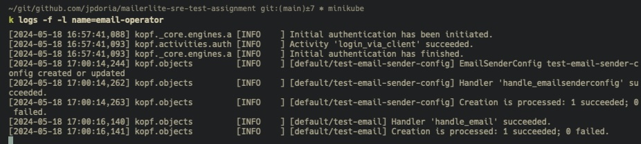
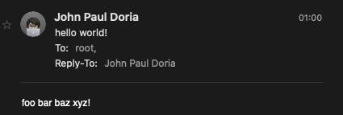

# About

Solution for the [MailerLIte SRE Test Assignment](https://gist.github.com/robgordon89/ea290c6f4dec89aab1cd8c2ebb9edfe8) ... but in Python. 😅

# Set up

Install minikube.

```bash
brew install minikube
```
Create a local k8s cluster with minikube.

```bash
minikube start
```

Make sure you’re in the proper context.

```bash
kubectl config current-context
```

Clone this repo.

```bash
git clone git@github.com:jpdoria/mailerlite-sre-test-assignment.git
```

Switch to the manifests directory.

```bash
cd mailerlite-sre-test-assignment/manifests
```

Apply the manifests in the following order.

```bash
kubectl apply -f crds.yaml
kubectl apply -f rbac.yaml
kubectl apply -f deployment.yaml
```

Update the `data.apiToken` in the [secret.yaml](manifests/secret.yaml) file with the working [MailerSend API token](https://www.mailersend.com/help/managing-api-tokens), which should be in base64 format.

```bash
echo -n 'mlsn.123...456' | base64 -w0 # to encode the token in base64
vim secret.yaml
kubectl apply -f secret.yaml
```

Update the [email.yaml](manifests/email.yaml) file with the sender, recipient, and message body.

```bash
vim email.yaml
kubectl apply -f email.yaml
```

Check the operator's logs by running this command: `kubectl logs -f -l name=email.operator`.



Check your mailbox for the email.



Delete the local k8s cluster.

```bash
minikube delete --all --purge
```

# Links
- https://kopf.readthedocs.io/en/stable/
- https://github.com/mailersend/mailersend-python